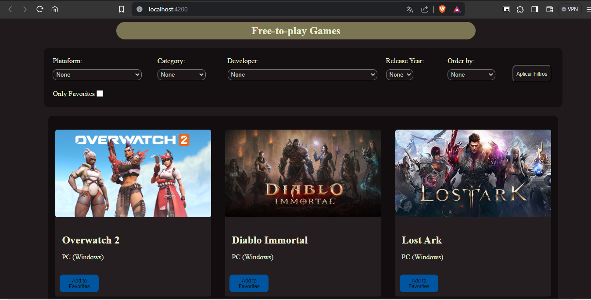
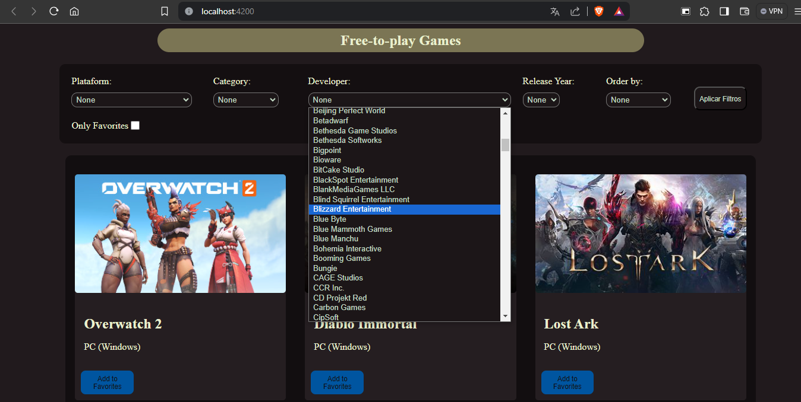
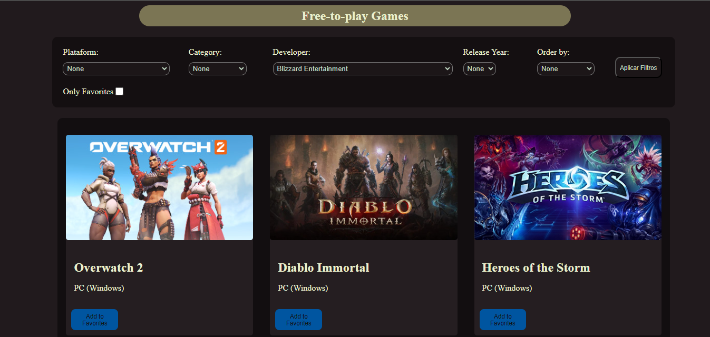
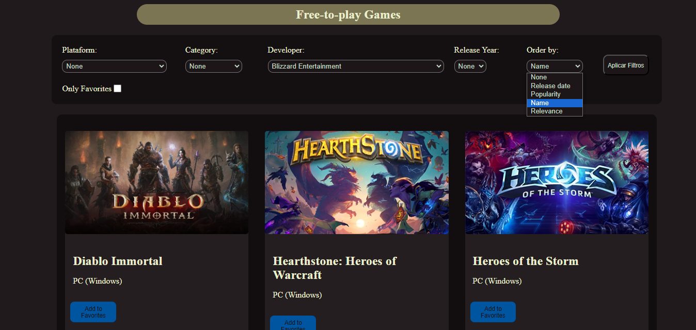
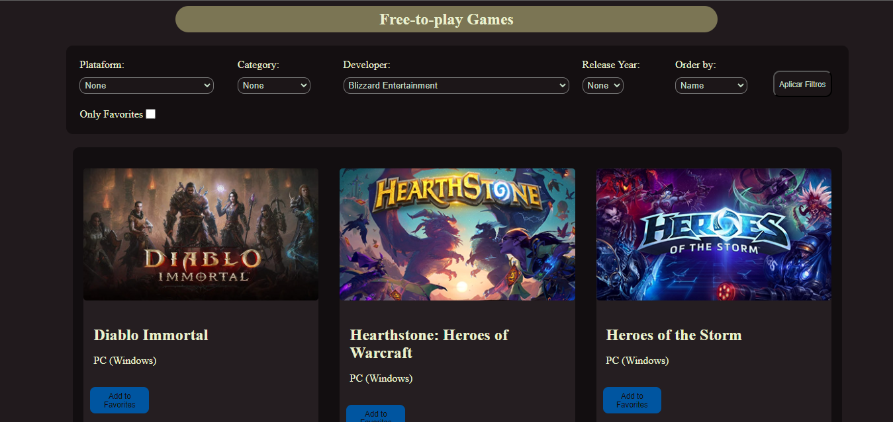
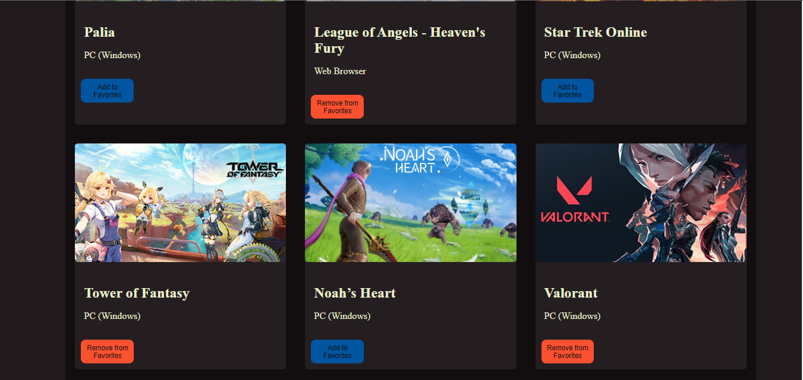
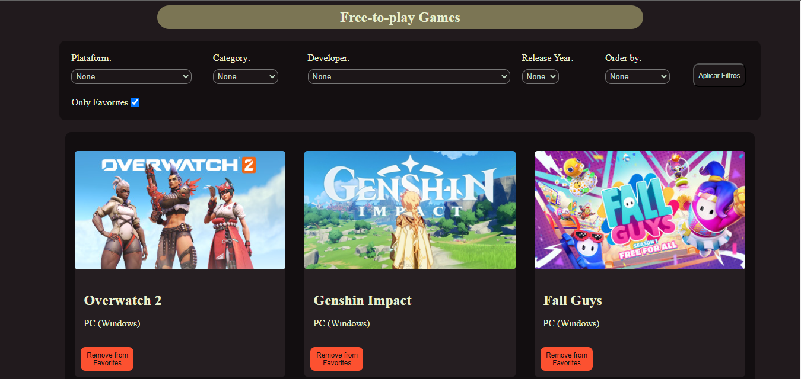
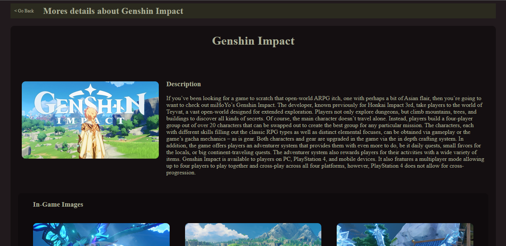
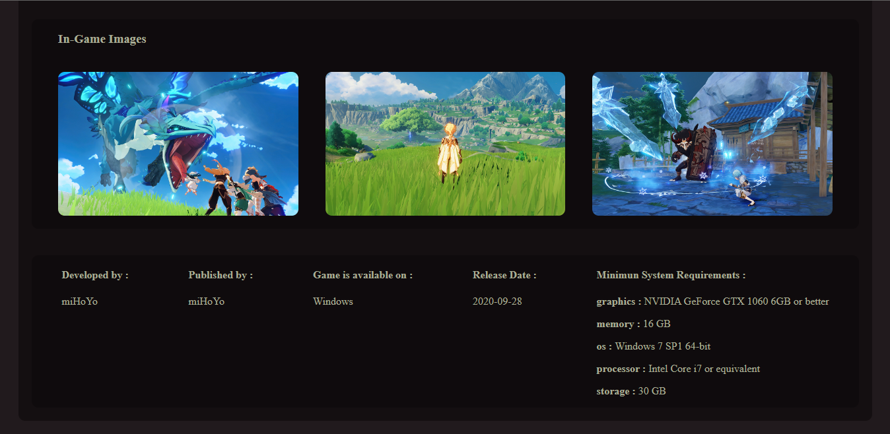

# SelecaoVlab

A princípio este é um repositório de um desafio para a implementação de um projeto em Angular de uma página que mostra jogos free-to-play baseado na freetogame API.

## Minha implementação

Tive como objetivos para este desafio criar uma tela inicial onde serão exibidos todos os jogos. 

Nesta página inicial é possível filtrar a listagem de jogos de vária maneiras, como por desenvolvedora e ano de lançamento.

Após aplicação do filtro :

Também é possível ordenar por alguns parametros a listagem de jogos, como por exemplo seu ano de lançamento ou ordem alfabética.

E por último mas não menos importante podemos adicionar um jogo aos favoritos e quando selecionado a opção "Only Favorites", a listagem será filtrada para mostrar apenas os jogos marcados como favoritos, junto com os outros filtros selecionados anteriormente.

Após escolher alguns favoritos podemos filtrar para mostrar apenas os jogos marcados como favorito.

E quando clicamos em algum jogo específico podemos ver um página com detalhes sobre o jogo.

## Instruções para o Desafio :

Olá, você foi selecionado para a fase de desafio técnico. Para prosseguir com o seu desafio, precisamos informar algumas questões.

- **Não faça um fork deste projeto, você deve fazer um clone local e criar um repositorio privado a partir dele**
- Para que as suas requisições funcionem, você precisa entrar na pasta proxy, fazer um `npm install` nela e em seguida `node ./server.js`.
- A documentação da API que você irá consumir pode ser encontrada em https://www.freetogame.com/api-doc.
- Note que para a requisição funcionar você deverá fazer sempre rodar o serviço node na pasta proxy e fazer suas requisições adicionando http://localhost:4123/ antes de cada url. Exemplo: caso deseje buscar todos os jogos, você deverá fazer um GET para a seguinte url: `http://localhost:4123/https://www.freetogame.com/api/games`. **Faça a requisição para o localhost usando http e não https**.
- Se o projeto não estiver rodando corretamente não se desespere, é intencional, existem alguns bugs que você deve corrigir para que o projeto funcione.
- Boa sorte =D
